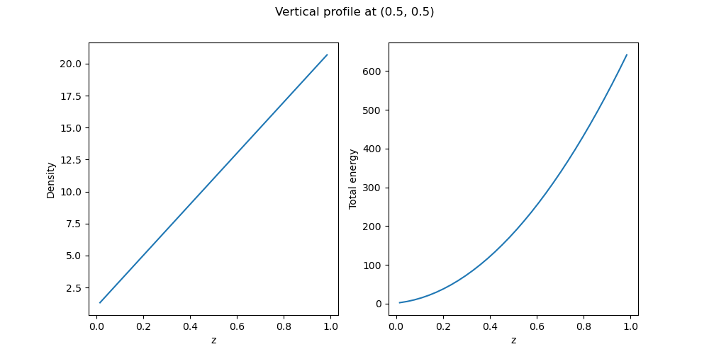
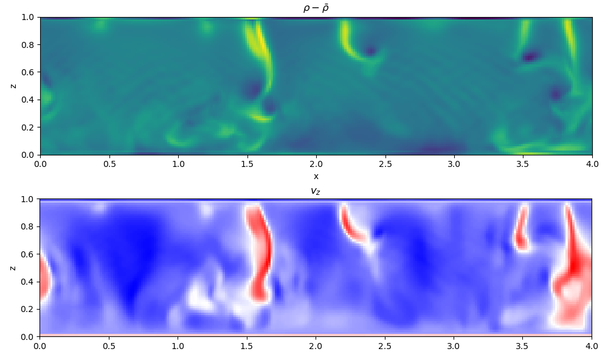

# pyablo

Analysis tools for dyablo

## Dependencies

. Python 3.6+
. HDF5 1.10+ (not tested on 1.8)
. Cython
. Pybind11

## Initializing submodules

This repo uses submodules. You can recover those by adding the `--recursive` option when cloning the repository. If you already have cloned the repo and not fetched the submodules, you can get them by using the following commands : 

```
git submodule init
git submodule update
```

## Build the package

In the source directory : 
```bash
mkdir build
cd build
cmake -DCMAKE_BUILD_TYPE=Release ..
make -j
```

Then you can add the `build` directory to your `PYTHONPATH` variable to get the `pyablo` module

## Usage

To load a snapshot create a `XdmfReader` object and use the `readSnapshot` method : 

```python
import pyablo

reader   = pyablo.XdmfReader()
snapshot = reader.readSnapshot('C91_iter0000000.xmf') 
```

### Getting information on the run by reading `.ini` files

To read info on the `.ini` files, be it the actual file you used or `last.ini` it is possible to use the `ConfigParser` package of Python : 

```python
from configparser import ConfigParser

config = ConfigParser(inline_comment_prefixes=('#',';'))
config.read('last.ini')

zmin  = config.getfloat('mesh', 'zmin')
zmax  = config.getfloat('mesh', 'zmax')
cor_z = config.getint('amr', 'coarse_oct_resolution_z')
bz    = config.getint('amr', 'bz')
Nz = cor_z * bz

print(f'Number of cells along Z axis at coarse resolution : {Nz}') 
```

### Getting information by probing locations

To get information in a snapshot, the main feature is to probe the location for a variable. Let's imagine we want to extract vertical line in the domain going from the position $(0.5, 0.5, 0)$ to $(0.5, 0.5, 1.0)$ we can create a vector of positions to probe :

```python
import numpy as np

# Centering the points on the cells
dz = (zmax-zmin) / Nz
z = np.linspace(zmin+0.5*dz, zmax-0.5*dz, Nz)
x = np.zeros_like(z)
y = np.zeros_like(z)

pos = np.stack((x, y, z)).T

rho   = snap.probeDensity(pos)
e_tot = snap.probeEnergy(pos)

fig, ax = plt.subplots(1, 2, figsize=(10, 5))
ax[0].plot(z, rho)
ax[1].plot(z, e_tot)
ax[0].set_xlabel('z')
ax[0].set_ylabel('Density')
ax[1].set_xlabel('z')
ax[1].set_ylabel('Total energy')

plt.suptitle('Vertical profile at (0.5, 0.5)')
plt.show()
```

Which should draw something like : 



The list of all callable methods of the `Snapshot` class can be found in [`srcs/pyablo.cpp`](srcs/pyablo.cpp). Note that if you try to probe a variable that has not been stored in the snapshot, pyablo will return an error : 

```python
p = snap.probePressure(pos)
```

will yield

```
ERROR : Attribute P is not stored in file !
```


### Going through cell indices

Probing the mesh is extremely expensive and can take a very long time with complex meshes. One way to avoid repeating this operation too often is to probe the cell indices. This allows you to retrieve for each position the index of the corresponding cell in the mesh, and then query the cells directly.

We can directly compare the execution on a simple mesh to see the difference : 

```python
import timeit

def probeDirectly():
    rho = snap.probeDensity(pos)
    e_tot = snap.probeEnergy(pos)
    mom = snap.probeMomentum(pos)
    lvl = snap.probeLevel(pos)

def probeById():
    ids = snap.getCellsFromPositions(pos)
    rho = snap.getDensity(ids)
    e_tot = snap.getEnergy(ids)
    mom = snap.getMomentum(ids)
    lvl = snap.getLevel(ids)


print('Probing directly the cells :')
dp_time = timeit.timeit(probeDirectly, number=100)
print(f' -> time : {dp_time:.4}s') 

print('Probing IDs + direct query :')
id_time = timeit.timeit(probeById, number=100)
print(f' -> time : {id_time:.4}s')
```


```
Probing directly the cells :
 -> time : 35.59s
Probing IDs + direct query :
 -> time : 5.907s
```

It is thus recommended to use this method to probe large files.

### Special method for regular grids

If you are using a regular grid (ie. `levelmin == levelmax`) then you can use another faster method to recover the grid. In this case, the grid can be mapped to a 3D numpy array. However, since the ordering of the grid follows the Morton Z-curve, the order of the cells have to be reordered first by getting a sorting mask. `pyablo` includes a few functions to help you with that. If your domain is a cube and not using the coarse slab mode you can directly get the sorting mask using the values of `bx`

```python
bx = config.getint('amr', 'bx')
by = config.getint('amr', 'by')
bz = config.getint('amr', 'bz')
level = config.getint('amr', 'level_min')

mask = snap.getSortingMask3d(level, bx, by, bz)
```

Once the mask is calculated it is possible to quickly extract all the data of the cube

```python
rho = snap.readAllFloat('rho')
```

This will return a list of values that has to be resized to the correct shape :

```python
Nx = 2**level*bx
Ny = 2**level*by
Nz = 2**level*bz

rho = np.array(snap.readAllFloat('rho'))[mask].reshape((Nz, Ny, Nx))

print(rho.shape)
```

If your grid is using the `coarse_oct_resolution` restriction in its`.ini` file, then these values are also to be passed to the `getSortingMask3d` method : 

```python
cor_x = config.getint('amr', 'coarse_oct_resolution_x')
cor_y = config.getint('amr', 'coarse_oct_resolution_y')
cor_z = config.getint('amr', 'coarse_oct_resolution_z')

mask = snap.getSortingMask3d(level, bx, by, bz, cor_x, cor_y, cor_z)

Nx = cor_x*bx
Ny = cor_y*by
Nz = cor_z*bz

rho = np.array(snap.readAllFloat('rho'))[mask].reshape((Nz, Ny, Nx))
```

**Important note** : Calculating the mask is also a long operation, in the case where you are parsing multiple snapshots of a fixed grid run, the mask will never change from one output to the next so it can be calculated only once to save time.

Please also note that the method calculating the mask is also available in 2D :

```python
getSortingMask2d(level, bx, by)
getSortingMask2d(level, bx, by, cor_x, cor_y)
```

## Full example on fixed grids

Once the array has been read it can be manipulated as any other array. Here's a full example to plot a vertical density variation slice of a convection run : 

```python
import pyablo
import numpy as np
import matplotlib.pyplot as plt
from configparser import ConfigParser

# Creating relevant objects/readers
reader = pyablo.XdmfReader()
snap   = reader.readSnapshot('C91_iter0017523.xmf')
config = ConfigParser(inline_comment_prefixes=('#',';'))
config.read('last.ini')

# Calculating domain size from the data
bx = config.getint('amr', 'bx')
by = config.getint('amr', 'by')
bz = config.getint('amr', 'bz')

lmin = config.getint('amr', 'level_min')
lmax = config.getint('amr', 'level_max')

if lmin != lmax:
    print('ERROR : This script only works for fixed grid runs')
    exit(1)

cor_x = config.getint('amr', 'coarse_oct_resolution_x')
cor_y = config.getint('amr', 'coarse_oct_resolution_y')
cor_z = config.getint('amr', 'coarse_oct_resolution_z')

xmin = config.getfloat('mesh', 'xmin')
xmax = config.getfloat('mesh', 'xmax')
zmin = config.getfloat('mesh', 'zmin')
zmax = config.getfloat('mesh', 'zmax')

Nx = bx*cor_x
Ny = by*cor_y
Nz = bz*cor_z

# Extracting mask and density
mask = snap.getSortingMask3d(lmin, bx, by, bz, cor_x, cor_y, cor_z)
rho = np.array(snap.readAllFloat('rho'))[mask].reshape((Nz, Ny, Nx))
vz = np.array(snap.readAllFloat('rho_vz'))[mask].reshape((Nz, Ny, Nx))/rho

rho_bar = np.average(rho, axis=(1, 2))
rho_bar = np.tile(rho_bar, (Nx, Ny, 1)).T
rho_prime = rho - rho_bar

# Making a slice, on the xz plane in the middle of the domain along y
ext=[xmin, xmax, zmin, zmax]
fig, ax = plt.subplots(2, 1, figsize=(10, 10))
ax[0].imshow(rho_prime[:,Ny//2,:], extent=ext)
ax[0].set_xlabel('x')
ax[0].set_ylabel('z')
ax[0].set_title(r'$\rho-\bar{\rho}$')

ax[1].imshow(vz[:,Ny//2,:], extent=ext, cmap='bwr')
ax[1].set_xlabel('x')
ax[1].set_ylabel('z')
ax[1].set_title(r'$v_z$')

plt.tight_layout()
plt.show()
```

This should give a plot like the following :



## Parsing a time-series

For now, there is no way to treat the `main.xmf` file generated by dyablo. Support for this time series will be included in the future, but for now all time series have to be treated manually. We provide a way to do this here in a simple way. This sample code calculates and plots the evolution of the mass, kinetic energy, internal energy and total energy in a simulation.

We start by importing all the relevant modules/packages:

```python
import pyablo
import os
import numpy as np
import matplotlib.pyplot as plt
from configparser import ConfigParser
from tqdm import tqdm
```

We create the reader and the config parser

```python
# Creating relevant objects
reader = pyablo.XdmfReader()
config = ConfigParser(inline_comment_prefixes=('#',';'))
config.read('last.ini')
```

We then read the list of files - in a suboptimal but working way - : 

```python
# Getting all xmf files sorted by index, and excluding the main file
flist = []
for f in os.listdir('.'):
  if f.endswith('.xmf') and not 'main' in f:
    flist.append(f)
flist.sort()
Nf = len(flist)
```

Then we iterate over all files, and use the dedicated methods to extract energy, mass and time in the domain : 

```python
# Storing the time series in separate lists
mass = []
Ek   = []
e    = []
E    = []
time = []

# iterating over all files by "step" steps
step = 1
for i in tqdm(range(Nf)[::step]):
  fn = flist[i]
  snap = reader.readSnapshot(fn)

  mass.append(snap.getTotalMass())
  Ek.append(snap.getTotalKineticEnergy())
  E.append(snap.getTotalEnergy())
  e.append(E[-1]-Ek[-1])
  time.append(snap.getTime())
```

Note that this could also be done extracting each field, and processing the data as usual.

Finally, we plot the result : 

```python
fig, ax = plt.subplots(2, 2, figsize=(10, 10))

ax[0,0].plot(time, mass)
ax[0,1].plot(time, Ek)
ax[1,0].plot(time, e)
ax[1,1].plot(time, E)

ax[0,0].set_xlabel('Time')
ax[0,1].set_xlabel('Time')
ax[1,0].set_xlabel('Time')
ax[1,1].set_xlabel('Time')

ax[0,0].set_ylabel('Mass')
ax[0,1].set_ylabel('Kinetic energy')
ax[1,0].set_ylabel('Internal energy')
ax[1,1].set_ylabel('Total energy')

plt.tight_layout()
plt.show()
```


